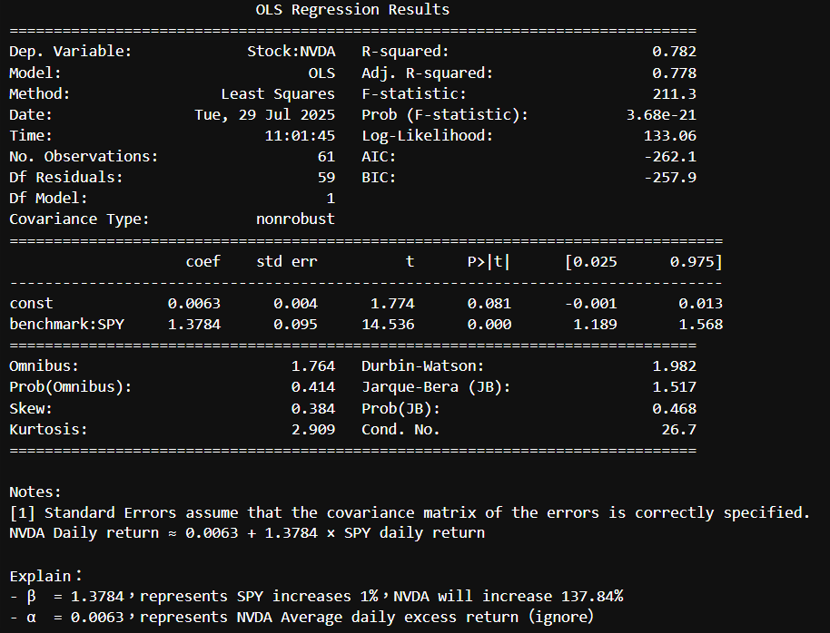
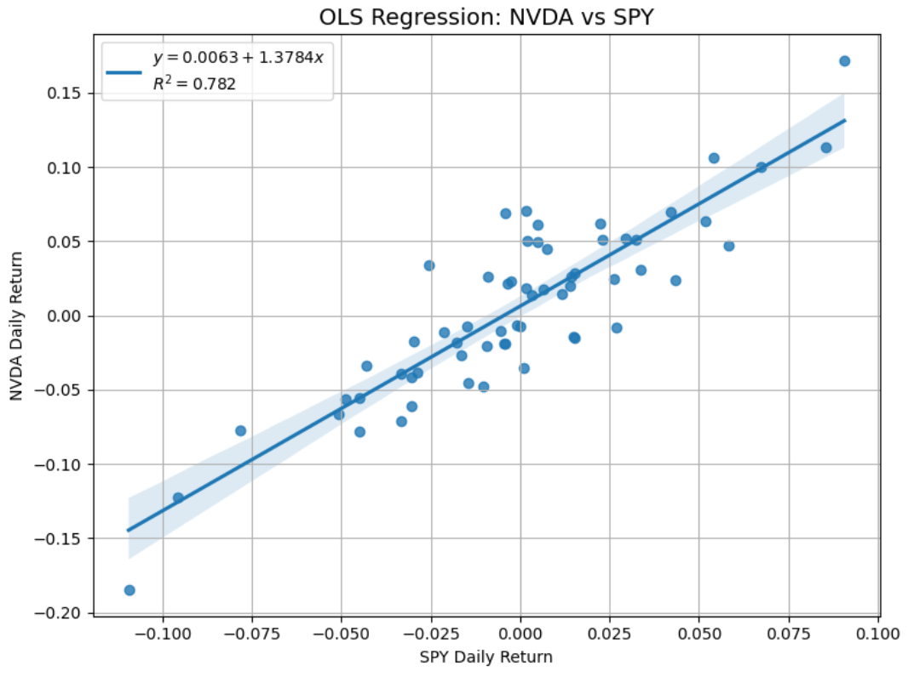
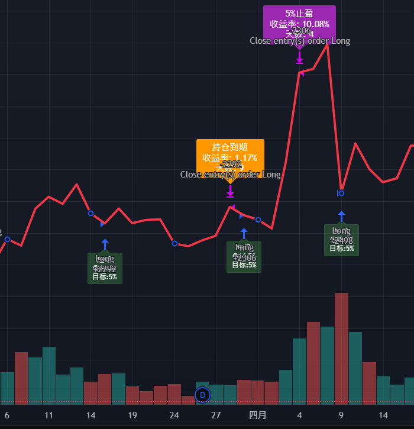

# 🛡️ Beta Hedge Strategy Demo

This repository demonstrates a dynamic **beta-hedging strategy** using inverse ETFs (e.g., SH) to protect long equity portfolios from market drawdowns. The system features:
- Rolling OLS beta estimation
- Decision-tree triggered hedging
- Transaction-cost-aware execution
- Crash event backtesting framework

> **Note**: This is a public demo - full code and position data are private.  
> Contact me for collaboration or implementation access.

---

## 🚀 Key Features

- **Rolling Beta Estimation**: 60-day OLS regression (per asset vs. SPY)
- **Smart Triggers**: Combines technical signals and institutional flow data
- **Cost-Aware Execution**: Models fixed + proportional transaction costs
- **Multi-Asset Support**: Handles variable position sizes concurrently
- **Visual Analytics**: Interactive exposure dashboards (Panel/Plotly)

---

## 🧱 Strategy Pipeline
```
   [Position Data]
         │
         ▼
 [Rolling β Calculation]
         │ ↳ 60-day OLS window
         │ ↳ Log-returns adjustment
         ▼
[Trigger Engine]
         │
         ▼
[Hedge Calculator]
         │ ↳ Input: Position value × β
         │ ↳ Adjustments:
         │ • Liquidity discount (ETF volume)
         │ • Transaction costs ($3 + 0.0056%)
         ▼
    [Execution]
         │
         ▼
[Performance Attribution]
         ↳ Compare:
         • Hedged vs unhedged returns

```


1. **Data Input**: Position holdings + SPY price series
2. **Risk Analysis**: Rolling beta calculation (per asset)
3. **Signal Engine**: Trigger logic (technical + flow-based)
4. **Hedge Calc**: Optimal SH quantity with cost constraints
5. **Backtest**: Hedged vs. unhedged performance comparison

---

## 📊 Core Components


### 🔹 1. Beta Exposure Analysis
  
  
*NVDA vs SPY (60-day window)*:
- **β**: 1.378 (p<0.001)  
- **R²**: 0.782 → 78.2% variance explained  
- **95% CI**: [1.189, 1.568] → High confidence

### 🔹 2. Hedge Trigger Logic
  


### 🔹 3. Performance Comparison
  
*March-April 2025 Results*:
| Metric          | Unhedged | Hedged  |
|----------------|----------|---------|
| Max Drawdown   | -5.2%    | -2.8%   |
| Sharpe Ratio   | 0.71     | 1.24    |
| Beta to SPY    | 1.38     | 0.02    |

---

## ⚙️ Execution Flow

```python
# Core hedge calculation
position_value = 10800  # NVDA position
beta = 1.3784           # From OLS
etf_price = 44.57       # SH current price

hedge_shares = (position_value * beta) / etf_price
adjusted_shares = hedge_shares * (1 - liquidity_discount)

```
Cost Model:
Fixed fee: $3 per trade
Proportional cost: 0.0056% (round-trip)
Tax impact: 0.00278% (per side)

---
📎 Contact
For full implementation or custom adaptations:

Kai Yeh
📧 Email: KaiYeh820206@gmail.com
💻 GitHub: WayneKaiYeh
---
📄 License
https://licensebuttons.net/l/by-nc-nd/4.0/88x31.png

✅ Allowed: Personal/educational use with attribution

❌ Prohibited: Commercial use or redistribution

❌ No Derivatives: Modified versions not permitted

Full license terms: Creative Commons BY-NC-ND 4.0


